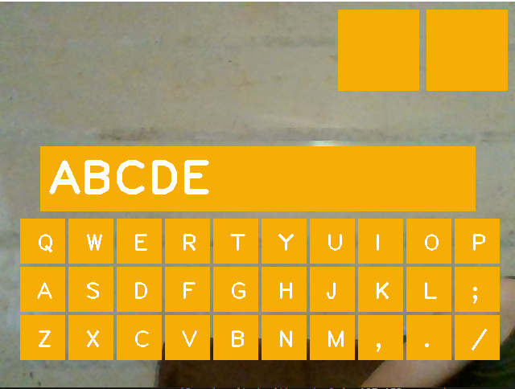
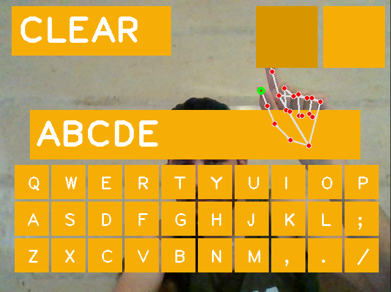

# AI VIRTUAL KEYBOARD

This is a virtual keyboard project based on computer vision. of course it is based on educational purposes and it is easy to use. Use the hand detection choose the button you want and when you want to click any button just bring down your first finger with your thumb finger. you can also clear the text and print them to a text file using the two rectangles in the top.

---

> python - opencv - mediapipe