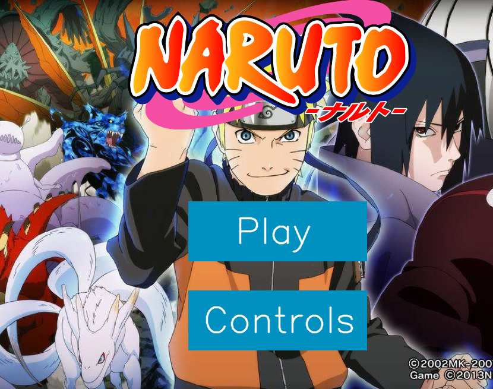
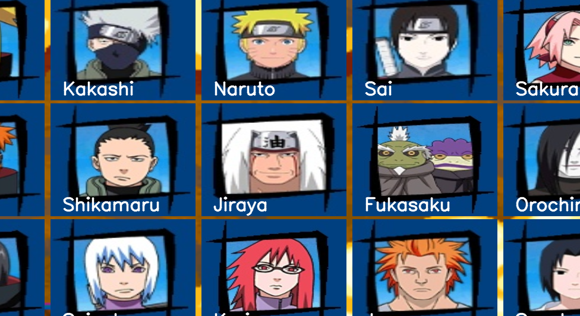
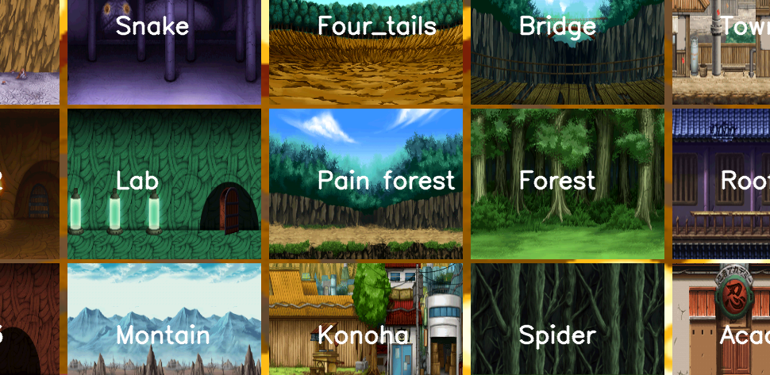
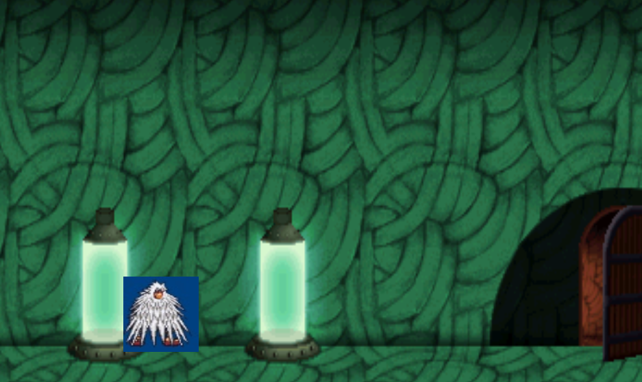
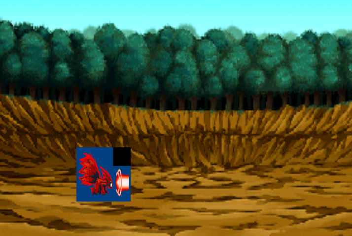

# Naruto OpenCV Game

This is an educational application based on opencv and naruto anime fans, it is not something very big or important but it is made for fun and educational purposes.

## Choose Character

## Choose Stage

In this game you can shoose any character and stages from naruto universe and play a little with it

## Gameplay

Unzip Naruto_Game for the images.Of-course it is not perfect but like i say only for fun.

>python-opencv
