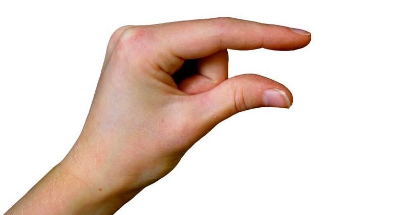

# POP BOX

This is a simple game made py python opencv build to be simple learning game in computer vision field.

---

This game is all about to pop up an rectangles using hand detection with a very simple control, using your your finger choose your option or choose the rectangle also and if you want to click or pop up the rectangles just close your first finger with your thumb.

> python - opencv - mediapipe